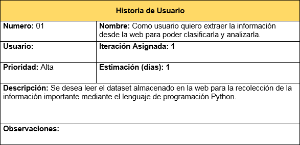

# Proyecto Implementado con XP

<h2>Integrantes :pushpin:</h2>

<ol>
  <li>Johnatan Guillermo Ruiz Bautista - 20181020034</li>
  <li>Brayan Alejandro Puentes Camargo - 20181020044</li>
  <li>Andrés Leonardo Baquero Hernández - 20181020124</li>
</ol>

<h2>Descripción del Proyecto :paperclip:</h2>
<p>Basados en un dataset de https://www.datos.gov.co/ presentar un proyecto en ambiente web que permita analizar la data cargada de acuerdo a lo que se considere relevante. La visualización debe contener resumen de datos y gráficas relevantes de los datos.</p>
<p>Se debe presentar de acuerdo a la metodología seleccionada los productos relacionados a las actividades del ciclo de vida de software que trabaja dicha metodología.</p>
<p>El producto se debe entregar con las siguientes indicaciones:</p>
<ul>
    <li>Análisis</li>
    <li>Diseño</li>
    <li>Codificación</li>
    <li>Pruebas</li>
    <li>Documentación</li>
</ul>

<h2>Herramientas Utilizadas :wrench:</h2>
<ul>
  <li>Python</li>
  <li>Flask</li>
  <li>Matplotlib</li>
  <li>Word</li>
  <li>Pytest</li>
  <li>Behave</li>
  <li>Información de un dataset extraído de <a href="https://www.datos.gov.co">Datos Colombia</a></li>
</ul>

<h1>Análisis del Proyecto</h1>
<p>Para la primer fase implementada con esta metodología, se hace la colección de unas historias de usuario que indicarán cual será la funcionalidad del proyecto, por cada una de sus partes descrita por el cliente. Además, los beneficios obtenidos una vez se implemente cada parte funcional.</p>
<h2>User Stories</h2>
<p align='center'>
    
    
    
    
</p>

<h1>Diseño del Proyecto</h1>
<p>Para la segunda fase del proyecto, se cuenta con el uso de tarjetas CRC (Clase, Responsabilidad, Colaboradores), esto con el fin de describir cuáles serán las clases que se van a utilizar en el proyecto, qué responsabilidad tendrá cada una de ellas respecto al proyecto, y con qué otras clases va a interactuar.</p>
<h2>CRC Cards</h2>
<p align='center'>
    
    
    
    
    
</p>

<h1>Pruebas del Proyecto</h1>
<p>Para realizar las pruebas unitarias del proyecto, es necesario dirigirse a la raíz del proyecto y ejecutar el siguiente comando:</p>

```bash
$ pytest test.py
```
 


